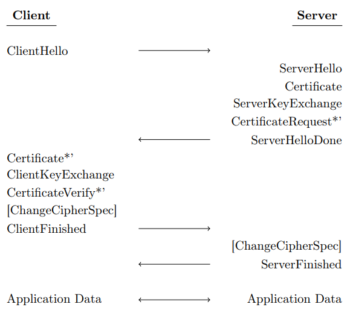
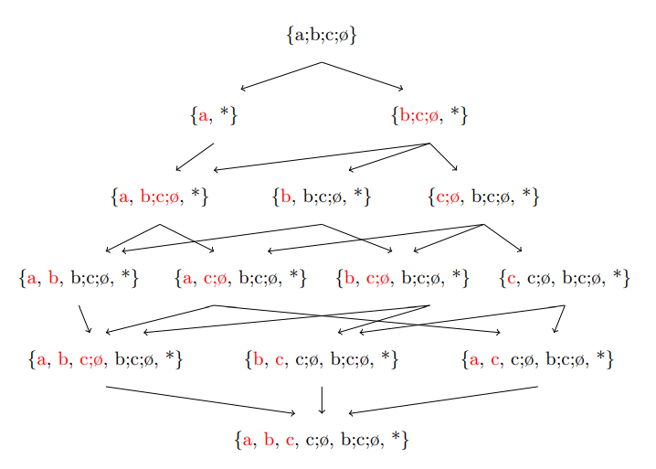
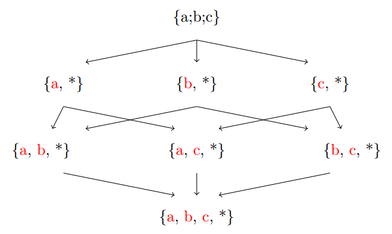
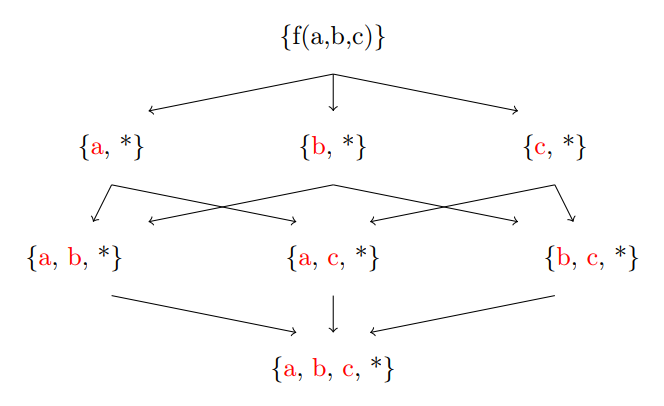

# Formal Verification of Hybrid Post-Quantum TLS 1.2

This repository contains the formal specification and verification of a hybrid post-quantum key exchange mechanism for TLS 1.2, as described in the IETF draft: https://datatracker.ietf.org/doc/html/draft-campagna-tls-bike-sike-hybrid. 

The protocol combines classical Elliptic Curve Diffie-Hellman with Post-Quantum Key Encapsulation Mechanisms to achieve post-quantum security.

The verification is performed using **Maude-NPA**, using four different cryptographic refinements: Head/Tail, Gather, Associativity and VariadicSymbol.

## Table of Contents

- [Repository Structure](#repository-structure)
- [Prerequisites](#prerequisites)
- [Cryptographic Refinements](#cryptographic-refinements)
  - [Head/Tail](#headtail)
  - [Gather](#gather)
  - [Associativity](#associativity)
  - [VariadicSymbol](#variadicsymbol)

## Repository Structure

| Folder | Description |
|-------------------------|-----------------------------------------------------------------------------|
| [`src/`](./src/README.md) | Contains the main Hybrid Post-Quantum TLS 1.2 protocol specifications in Maude, one for each of the four refinements. |
| [`test`](../test/README.md) | Includes basic example models demonstrating each cryptographic refinement, verified in Maude-NPA, Tamarin Prover , and ProVerif. |
| [`results`](../results/README.md) | Stores all verification output results from running the models in `src/` and `test/`. |
| `scripts/` | Contains shell scripts to automate the execution and verification of the models. |
| `maude/` | Supporting Maude modules required for running Maude-NPA. |
| `maude-npa.maude` | The specific version of the Maude-NPA tool used for the analyses |
| `LICENSE` | License of the repository |

## Prerequisites

To execute and verify the Hybrid Post-Quantum TLS 1.2 protocol specifications in this repository, the following tool versions were used:

- **Maude-NPA**: version 3.1.4

For the basic example refinements verified across Maude-NPA, Tamarin Prover and ProVerif:

- **Maude-NPA**: version 3.1.4
- **Tamarin Prover**: version 1.10.0
- **ProVerif**: version 2.05

The specific Maude-NPA tool file provided in the repository (`maude-npa.maude`) corresponds to version 3.1.4, and the supporting modules in `maude/` are compatible with Maude 3.5, which is also used in Tamarin Prover.

Note: Newer versions of these tools may also work, but the results in `results/` were obtained with the versions listed above.

## Cryptographic Refinements

The four refinements model different ways of handling concatenation and decomposition of messages (especially the hybrid combination of classical and post-quantum components). They differ in how the intruder can decompose concatenated terms, which affects the inferred intruder knowledge.

### Head/Tail

This refinement is inspired by the concepts of *head* and *tail* from functional (Haskell) and logic (Prolog) programming. It allows the intruder to recursively extract every possible subsequence from a concatenated string of *n* elements.

For example, given a term `a ; b ; c` (with *n*=3), the intruder can obtain:
- single elements: `a`, `b`, `c`
- contiguous chunks: `a ; b`, `b ; c`
- the full sequence: `a ; b ; c`

This provides the intruder with maximum decomposition power, modeling a strong adversary capable of splitting concatenations at any position.

### Gather

The *Gather* refinement uses Maude's built-in `gather` axiom (`gather(e E)`) to implement a decomposition behavior equivalent to Head/Tail. It is the Maude-native way of achieving the same recursive head/tail extraction.

Note: In the `test/` directory, the file names for Tamarin Prover and ProVerif also use "Gather" to indicate that these examples correspond to the Head/Tail approach (the strongest decomposition). However, Tamarin and ProVerif do not use Maude's gather axiom. The name is kept for consistency across tools.

### Associativity

This refinement relies solely on the associativity of the concatenation operator (e.g., `(a ; b) ; c = a ; (b ; c)`).

Decomposition is limited: the intruder can only extract **individual atomic elements** from a concatenation, but **cannot** obtain contiguous chunks of more than one element (e.g., from `a ; b ; c`, only `a`, `b`, `c` are obtainable, not `a ; b` or `b ; c`).

This models a weaker intruder regarding message decomposition, which can be useful when verifying properties that should hold even under restricted adversary capabilities, or to reduce state space in analysis.

### VariadicSymbol

This approach models concatenation with a variadic (n-ary) symbol `f`. The algebraic theory includes equations that allow extracting each individual argument of `f`.

Similar to Associativity, the intruder can only recover **single atomic elements**, not larger contiguous subsequences (chunks).

This again limits intruder knowledge compared to Head/Tail or Gather, potentially simplifying verification or focusing on scenarios where chunk extraction is not realistic.

**Key observation**: Both Associativity and VariadicSymbol sacrifice the ability to obtain multi-atom subsequences, thereby reducing intruder knowledge. This can be advantageous depending on the security property being verified and the desired balance between realism and tractability.

